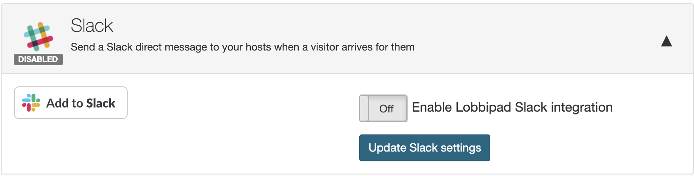
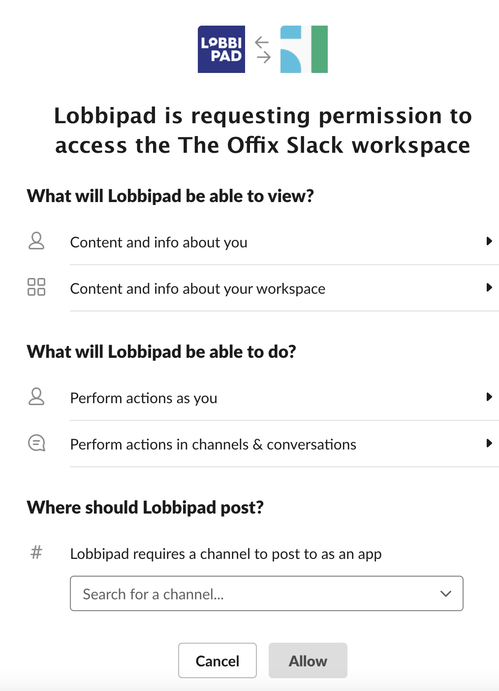

# Slack integration

Lobbipad Slack integration allow Lobbipad hosts to receive Slack notification when
their visitors check in. 

###How to install Slack app

On our  [integrations page](https://lobbipad.com/settings/api/integrations) you can find the Slack option.

Pick 'Add to Slack' and start the process of linking your Slack company account to Lobbipad. We only request the permissions we need to send your hosts private messages when a visitor arrives.
First you need to pick the correct Slack company account.

After connecting Lobbipad with Slack on the same page in Lobbipad dashboard, click enable slack integration and save company settings.